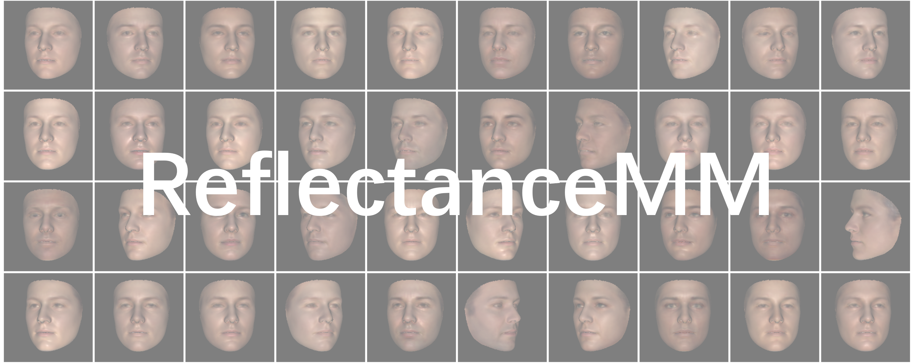

# ReflectanceMM

This is a PyTorch implementation of the following paper:

**Learning a 3D Morphable Face Reflectance Model from Low-cost Data**, CVPR 2023.

Yuxuan Han, Zhibo Wang and Feng Xu

[Project Page](https://yxuhan.github.io/ReflectanceMM/index.html) | [Paper](https://arxiv.org/abs/2303.11686)



**Abstract**: *Modeling non-Lambertian effects such as facial specularity leads to a more realistic 3D Morphable Face Model. Existing works build parametric models for diffuse and specular albedo using Light Stage data. However, only diffuse and specular albedo cannot determine the full BRDF. In addition, the requirement of Light Stage data is hard to fulfill for the research communities. This paper proposes the first 3D morphable face reflectance model with spatially varying BRDF using only low-cost publicly-available data. We apply linear shiness weighting into parametric modeling to represent spatially varying specular intensity and shiness. Then an inverse rendering algorithm is developed to reconstruct the reflectance parameters from non-Light Stage data, which are used to train an initial morphable reflectance model. To enhance the model's generalization capability and expressive power, we further propose an update-by-reconstruction strategy to finetune it on in-the-wild datasets. Experimental results show that our method obtains decent face-rendering results with plausible specularities.*

## Environment
1. create an virtual environment using conda:

```
conda create -n refmm python=3.8
conda activate refmm
```

2. install torch, torchvision, and pytorch3d:
```
pip install \
    https://download.pytorch.org/whl/cu116/torch-1.13.1%2Bcu116-cp38-cp38-linux_x86_64.whl \
    https://download.pytorch.org/whl/cu116/torchvision-0.14.1%2Bcu116-cp38-cp38-linux_x86_64.whl

conda install https://anaconda.org/pytorch3d/pytorch3d/0.7.4/download/linux-64/pytorch3d-0.7.4-py38_cu116_pyt1131.tar.bz2
```

3. install other libs:

```
pip install -i https://pypi.tuna.tsinghua.edu.cn/simple \
    numpy==1.19 \
    scikit-image==0.19.1 \
    scipy==1.8.0 \
    pillow==9.0.1 \
    pyyaml==6.0 \
    opencv-python==4.4.0.40 \
    tensorboard==2.4.0 \
    kornia==0.6.5 \
    dominate==2.6.0 \
    trimesh==3.10.7 \
    tqdm==4.62.3 \
    protobuf==3.20.1 \
    matplotlib==3.3.0 \
    lpips
```

## Data Preparation
1. Download the pretrained ArcFace and ResNet model following the instructions of [Deep3DFaceRecon_pytorch](https://github.com/sicxu/Deep3DFaceRecon_pytorch#prepare-prerequisite-models-1), and put them into the checkpoints directory as:
```
ReflectanceMM
|- checkpoints
    |- recog_model
        |- ms1mv3_arcface_r50_fp16
            |- backbone.pth
    |- init_model
        |- resnet50-0676ba61.pth
```

2. Download the `BFM_model_front.mat` following the instructions of [Deep3DFaceRecon_pytorch](https://github.com/sicxu/Deep3DFaceRecon_pytorch#prepare-prerequisite-models), and put it into the BFM directory. Then, run the following command to convert the BFM09 to our format to obtain `morphableModel-2009.pkl`: `python convert_bfm09.py`. After the above steps, the structure of BFM folder should be:
```
ReflectanceMM
|- BFM
    |- BFM_model_front.mat
    |- morphableModel-2009.pkl
    |- uvParametrization.pkl
    |- similarity_Lm3D_all.mat
```

3. Download the ReflectanceMM model from [here](https://cloud.tsinghua.edu.cn/d/15252b80c1cd48a383a8/). It contains our Lighting PCA model, initial ReflectancMM trained on Multi-PIE, and the final ReflectanceMM after finetuned on FFHQ. Organize it as:
```
ReflectanceMM
|- RefMM
```

4. Download and process the FFHQ dataset (resolution 256x256) according to this [document](PrepareDataset.md).

## Training
1. Jointly do face reconstruction and model finetuning on the FFHQ dataset, then you can find the finetuned ReflectanceMM model at `RefMM/finetuned_refmm_model.pkl`.

```
sh train.sh
```

2. We provide an example to integrate our model to the CNN-based self-supervised face geometry reconstruction pipeline (just like [Deep3DFaceRecon_pytorch](https://github.com/sicxu/Deep3DFaceRecon_pytorch)) on the FFHQ dataset:
```
sh train_recon_geo.sh
```

## Contact
If you have any questions, please contact Yuxuan Han (hanyx22@mails.tsinghua.edu.cn).

## Citation
Please cite the following paper if this model helps your research:

```
@inproceedings{han2023ReflectanceMM,
    author = {Han, Yuxuan and Wang, Zhibo and Xu, Feng},
    title = {Learning a 3D Morphable Face Reflectance Model from Low-cost Data},
    booktitle = {CVPR},
    year={2023}
}
```

## Acknowledgments
The basic code structure is heavily borrowed from [Deep3DFaceRecon_pytorch](https://github.com/sicxu/Deep3DFaceRecon_pytorch), and the implementation of SH lighting is adapted from [NextFace](https://github.com/abdallahdib/NextFace). We thank the authors for their great effort.
